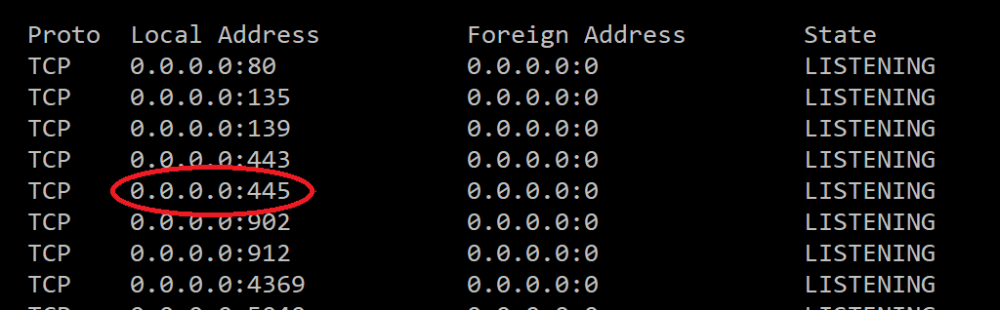

# SMBServer VFS

Welcome to the Windows SMBServer Virtual File System environment!
This code base offers an SMB2/3 server running on Windows in User mode.
This code has the _potential_ to support applications on Windows in the style of Fuse in the *nix world.

## Video Introduction
I gave a talk about this code base at The SNIA Storage Developer Conference in September 2018. 
[Its here on YouTube](https://www.youtube.com/watch?v=BB-fX2xuPsA).
The best demo starts at 26 minutes :-)

## Build
We use the Microsoft Visual Studio C++ build environment. 
The code is configured for VS 2015 or later.
This is a 64 bit project.

### Dependencies
The code only has few dependencies:
1. Windows SDK
Comes with Visual Studio.

2. Boost
Available from [boost](https://www.boost.org/)

To configure boost, download the latest release of boost headers and libraries built for Windows 64 bit.
Update the props file in \props folder to have the correct path.

So in props\Boost64.props edit this line:
> &lt;BOOST_DIR&gt;D:\build\Boost\boost_1_65_1&lt;/BOOST_DIR&gt;

Now, open __vfs.sln__ in Visual Studio, and build _release 64-bit_.
There are some warnings, but all dlls and one exe should build error free.

## Config
SMB2/3 runs over TCP on well known port numbers. The main port (now-a-days) is port 445. The Windows implementations do not allow deviating from this port, so the 1st thing to do in order to run a Windows User mode SMB2/3 server is to free port 445 from the clutches of the Windows Kernel.

Open a command prompt and type `netstat -an`. On a normal windows system, you will see port 445 is in use, like this:

This code base offers two ways to free port 445.

### 1. Free445
There is a stand alone subproject called Free445. Build this, and then run it as local admin on your machine.

It will disconnect the SMB server built into Windows from the Netbios transport.
This has the effect of freeing the 445 port, so that we can then bind our server to it (The Windows Server service is still running - we'll be using this later).
The port 445 will remain free for the duration of this boot of Windows. 
On re-booting, port 445 will again be bound to the Kernel mode MS supplied SMB server.

### 2. Windows Service
Running a local admin program each time we want to run our SMBServer is not a good approach, so the SMBserver code also come supplied with a Windows Service called NetManService.
This contains the same code as the Free445, but wrapped in a Windows service, so that after initial installation (that requires elevated permissions), the service can be run from a non-elevated executable to achieve the same result - freeing port 445.

To get this working, open QCIFSSever\NetManService\NetManService.sln in a new copy of Visual Studio, and build _release 64-bit_. This makes a new exe under Data\x64\DLL_Data\vfs\QCIFSProcessor\NetManService. 
In order to install the service we need to run with KernelServer.exe elevated privileges. We also need to clear a reg key, to get the QCIFSProcessor.dll to re-install itself.
Therefore open regedit at: HKEY_LOCAL_MACHINE\SOFTWARE\vfs\SMB3 Server\Vfs. Find and delete the key called 'QCIFSProcessor'. This will cause the QCIFSProcessor.dll to re-install, and install the service as a consequence.

If you run KernelServer.exe without having built NetManService.exe, you will get a red line in the log as follows:

Once you have built the NetManService, KernelServer can be run with elevated privileges to install it. *Don't forget to clear the registry first!* See above.

## Running
RUNME.bat runs KernelServer.exe built in the **build** step. This exe has no knowledge of SMB, it just loads dlls from pre-configured directories, and offers simple services to register factory functions to allow services to be called at runtime. This is an example of the inversion of control design principle [IoC](https://en.wikipedia.org/wiki/Inversion_of_control).

On booting successfully the set of DLLs supplied should load some logging facilities (both console and file based logging are built in), and it loads the set of DLLs that implement our SMB2/3 server.

All being well, the console should look something like this:

## Validating the boot
Now, check the boot log, by scrolling back in the console window.

We need to establish if we managed to bind to port 445.
All being well, you'll see this:

However, if for some reason port 445 cannot be bound to, you'll see something like this:

# Architecture
See the presentation first given at SNIA SDC 2018 for architecture details, available in the root directory of this code base. 

# Example Plugins
This code base comes with two example plugins, that try to demonstrate the power of the SMB Server and VFS semantics. 

## QCIFSTest
The simpler of the two is called QCIFSTest. This adds a share to the SMB server called `test`. Once the server is booted and bound to port 445, open a command prompt and try the following:

The newly mapped drive should now be available to explorer. Normal files and folders can be created and deleted. PLease see the SNIA SDC presentation for details of what has just happened!

## QCIFSSofa
The other example plugin is a little more complicated, but really starts to show the power of a VFS. This is *not* a normal filesystem! Its called QCIFSSofa because it uses CouchDB (http://couchdb.apache.org/) as an index of some mp3 files. It offers folders that contain the results of dynamic queries to CouchDB views.

To load the database, we use a simple python script to find the mp3 files in my music collection, and read some simple header info from each file, such as duration and tracknumber. See `loadMetadata.py` for details.

# Contributing
Please read CONTRIBUTING.md for details on our code of conduct, and the process for submitting pull requests to us.

# Versioning
We use [SemVer](https://semver.org/) for versioning. For the versions available, see the tags on this repository.

# Authors
James Cain - Initial work - Grass Valley, A Belden Brand

# Acknowledgments
Thanks to (current and former) colleagues for helping build this code.

Special mentions go out to:
- Michael Weaver
- Fang Ren
- Rob Hinchliff 

Additional thanks are due to the following:
- All the sponsors and attendees of the SNIA SDC SMB plugfest over the years
- The Grass Valley Management for having the foresight to support this open source development.
